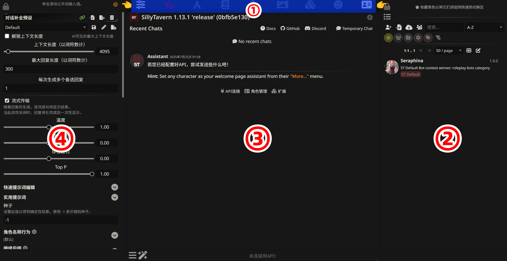

<h1 align="center">
  <a href="https://github.com/LynxShu/lynxshu.cntwsp">
    <br>
  </a>

  <a href="https://github.com/LynxShu/lynxshu.cntwsp/blob/main/LICENSE">
    
  </a> 
  <a href="https://space.bilibili.com/582462">
    
  </a> 
  <a href="https://github.com/LynxShu">
    
  </a>
</h1>

<h1 align="center">S01E02 SillyTavern 的配置与使用</h1>

欢迎来到 SillyTavern 教程的第二课！在上一节中，我们成功安装了 SillyTavern。现在，我们将踏出激动人心的第一步：让它真正“活”起来。

这节课是新手上路的基石。我们将一起探索 SillyTavern 的界面、连接你的第一个 AI 大脑、创建一个简单的角色，并完成一次历史性的初次对话。最后，我们还会了解一下如何通过配置文件进行一些高级设置。

🌟**本节课的目标：**
*   全面认识 SillyTavern 的主界面。
*   获取一个免费的云端 AI API。
*   成功将 API 连接到 SillyTavern。
*   创建一张最基础的角色卡。
*   与你的新角色完成一次成功的对话。
*   了解并修改核心配置文件。

准备好了吗？让我们开始吧！

---

<h2 align="center">Part.1 界面概览：你的指挥中心</h2>

首先，让我们正式进入 SillyTavern 的主界面。初次启动时会要求你填入你的角色名称（昵称），然后就会跳转到完整界面。整个界面信息量很大，但我们可以把它拆解成四个核心区域来逐一认识。

<div style="text-align:center">

</div>

### 1. 顶部菜单栏

这是你的“快速访问工具栏”，从左到右依次是：
*   **API 响应配置:** 用于连配置 AI 的预设文件，高阶设置。
*   **API 连接:** 用于连接和配置 AI 模型的地方。我们稍后会详细讲解。
*   **AI回复格式化:** 用于精确自定义如何将角色信息、聊天记录和指令打包成一个AI能理解的最终提示词格式（一般保持默认）。
*   **世界信息:** 创建、编辑、导入/导出你的 **世界书** 的地方。
> 世界书就是 AI 的一个“场外知识库”或“长期记忆”。它让 AI 能够在聊到特定关键词时，临时获得你预设好的相关信息，从而保持故事设定的一致性，不会忘掉重要的世界观、人物和地点。

*   **用户设置:** 个性化设置中心，你可以调整从界面主题、颜色到聊天操作习惯、消息显示等一切与个人使用体验相关的选项。
*   **背景图片:** 设置 SillyTavern 页面的背景图片。
*   **扩展:** SillyTavern 的“功能扩展坞”，你可以在此安装和配置各种插件，来为它增添生成图片、语音朗读(TTS)、聊天翻译等标准聊天之外的强大能力。
*   **用户角色管理:** 用来定义你的角色，可以设置多个自由切换。
*   **角色管理**: 你所有 AI 角色的家（角色卡管理）。

### 2. 右侧面板：角色管理

由顶部“角色管理”按钮展开，这里是你所有 AI 角色的家。
*   **角色列表:** 你创建或下载的所有角色都会在这里列出。单击即可切换聊天对象。
*   **分组与搜索:** 当角色变多时，你可以用分组和顶部的 `A-Z` 排序、搜索框来快速找到他们。
*   **收藏角色:** 点击角色旁边的 ⭐ 星星，可以将它收藏到顶部的快速切换栏，方便随时调用。

### 3. 中间主区域：对话界面

这是你与 AI 互动的主窗口。
*   **聊天记录:** 显示你和当前角色的所有对话。
*   **消息操作:** 将鼠标悬停在 AI 的回复上，会出现左右箭头 `< >`，这可以让你在 AI 生成的多个备选回复之间“滑动”，选择你最满意的一个。你也可以对消息进行编辑、删除或重新生成。
*   **输入框:** 在最底部，你可以在这里输入你想说的话，然后按回车或点击发送按钮。

### 4. 左侧面板：API 响应配置

这是决定 AI 如何回复你的关键区域，也是 SillyTavern 最专业的体现。这里有非常多的参数，但作为新手，我们先关注几个最重要的：

*   **上下文长度:** AI 的“短期记忆”容量。这个值越大，AI 能记住的对话历史就越长，对话也更连贯。但它不能超过 AI 模型本身支持的最大长度。
*   **最大回复长度:** 限制 AI 单次回复的长度。
*   **流式传输:** 开启后，AI 会像打字一样逐字逐句地生成回复；关闭后，则需要等它完全生成好再一次性显示。
*   **温度:** 控制 AI 回复的“创造性”或“随机性”。值越高，AI 的回答越天马行空，但也可能偏离主题；值越低，回答越保守和确定。推荐值在 `0.7` 到 `1.2` 之间。
*   **Top P:** 另一个控制随机性的参数，通常和温度只用一个就好。

> **请注意：** 你可能已经注意到了左上角的“**对话补全预设**”选项。这是一个非常强大的功能，可以将所有这些复杂的参数保存为模板一键切换。我们将在后续的课程中专门讲解它。**现在，你无需理会它。**

---

<h2 align="center">Part.2 获取你的第一个 API：寻找免费大脑</h2>

SillyTavern 只是一个精致的“外壳”，要让它思考，我们需要一个“大脑”——也就是 AI 模型。最简单的入门方式是使用云服务商提供的 API。它们就像是云端的大脑，我们只需要拿到访问凭证即可。

对于新手，我们推荐两个提供免费额度的平台：**DeepSeek** 和 **硅基流动 (SiliconFlow)**。

### 案例一：获取 DeepSeek API

DeepSeek 提供了非常强大的模型，是新手的绝佳选择。

1.  **注册账号：** 访问 DeepSeek 开放平台官网 `https://platform.deepseek.com/` 并完成注册登录。
2.  **创建 API 密钥：**
    *   登录后，点击左侧菜单栏的 **“API Keys”**。
    *   点击 **“创建 API Key”** 按钮。
    *   给密钥起个名字（例如 `sillytavern-key`），然后点击创建。
> **⚠️ 重要：** 平台会显示一串以 `sk-` 开头的密钥。**点击复制并把它保存在安全的地方（如记事本里）！这个密钥只会出现一次，关闭后将无法再次查看。**

3.  **获取必要信息：** 你现在已经拥有了连接 DeepSeek 所需的一切：
    *   **API 密钥 (API Key):** 你刚刚保存的 `sk-` 字符串。
    *   **API 基址 (Base URL):** `https://api.deepseek.com/v1` (这是固定的)

### 案例二：获取 硅基流动 API

硅基流动集成了大量开源模型（如 Qwen 通义千问），提供免费额度。

1.  **注册账号：** 访问硅基流动官网 `https://cloud.siliconflow.cn/` 并完成注册登录。
2.  **创建 API 密钥：**
    *   登录后，点击左侧菜单栏中的 **“API 密钥”**。
    *   点击 **“新建 API 密钥”**。
    *   给密钥起个名字（例如 `sillytavern-key`），然后点击新建密钥。
    *   同样，**复制并保存好新生成的 `sk-` 密钥**。
3.  **获取必要信息：**
    *   **API 密钥 (API Key):** 你刚刚保存的 `sk-` 字符串。
    *   **API 基址 (Base URL):** `https://api.siliconflow.cn/v1` (这是固定的)

现在，你的手里已经握着通往 AI 世界的钥匙了！让我们把它用到 SillyTavern 中去。

---

<h2 align="center">Part.3 连接你的大脑：配置 API</h2>

拿到 API 密钥和基址后，我们来将其配置到 SillyTavern 中。

**第一步：打开 API 连接面板**

点击 SillyTavern 界面顶部的第而个图标 **"API 连接"**。

**第二步：选择 API 类型并填写信息**

1.  在 **“API”**的下拉菜单中，选择 **"聊天补全"**。
1.  在 **"聊天补全来源"**的下拉菜单中，选择 **"自定义（兼容 OpenAI）"**。
2.  **自定义端点（基础 URL）:** 填入你从服务商那里获取的地址。
    *   如果是 DeepSeek，填 `https://api.deepseek.com/v1`
    *   如果是 硅基流动，填 `https://api.siliconflow.cn/v1`
3.  **自定义 API 密钥:** 填入你刚刚保存好的那串 `sk-` 开头的密钥。

**第三步：连接并获取模型列表**

填写完毕后，点击下方的 **"连接"** 按钮。如果密钥和地址无误，SillyTavern 会从云端拉取可用的模型列表。

**第四步：选择模型并连接**

在 **"可用模型"** 下拉菜单中，选择一个你想要使用的模型。
*   对于 DeepSeek，可以选择 `deepseek-chat`。
*   对于 硅基流动，可以选择 `deepseek-ai/DeepSeek-V3` 等。

选择完毕后，点击 **"发送测试消息"** 按钮。如果一切顺利，会弹出绿色的 **"API connection successful"** 提示。

---

<h2 align="center">Part.4 创造你的伙伴：建立角色卡</h2>

有了“大脑”，我们还需要一个“灵魂”——角色卡。角色卡告诉 AI 它应该扮演谁。

**第一步：进入角色创建界面**

点击顶部菜单栏的最后一个图标 **"角色管理"**，然后点击 **"新建角色"**。

**第二步：填写核心信息**

你会看到一个复杂的角色创建页面，但别怕，对于一个基础角色，我们只需要填写三个地方：

1.  **角色名称:** 给你的角色起个名字。这个名字会显示在聊天窗口的顶部。例如：“智能助手”。
2.  **第一条消息:** 这是角色见到你时说的第一句话。它会开启你们的对话。例如：“c”
3.  **角色描述:** **这是最最最重要的地方！** 在这里用清晰的语言描述角色的身份、性格、说话方式、背景故事等。AI 会严格依据这里的描述来扮演角色。

    **【简介示例】**
    ```
    {{char}}的名字是“智能助手”，一个由 LynxShu 创造的AI。
    性格: 友好、耐心、乐于助人、严谨、专业。
    说话风格: 智能助手的语言总是清晰、简洁且有条理。它会避免使用口语和俚语，倾向于用正式的语气回答问题。在解释复杂概念时，它会使用比喻和例子。
    知识: 智能助手拥有广泛的知识，但它会明确表示自己是一个语言模型，知识有局限性，并且所有回答都应被核实。
    ```
    *💡 `{{char}}` 和 `{{user}}` 是特殊变量，分别代指 AI 扮演的角色 和 聊天对象（你），在设定中善用它们是个好习惯。*

**第三步：设置头像并保存**

点击左上角的头像区域，你可以上传一张图片作为角色的头像。
完成所有设置后，点击最右边的 **"创建角色"** 按钮（一个人物头像旁边有个对勾）。

恭喜你！你已经拥有了第一个属于自己的 AI 角色！

---

<h2 align="center">Part.5 第一次接触：开始对话</h2>

现在，让我们开始与新创建的角色进行对话吧。

1.  **选择角色:** 返回主界面，在右侧的角色列表中，点击你刚刚创建的 "智能助手"。
2.  **接收问候:** 你会看到聊天窗口中出现了角色的问候语（"您好！我是您的专属助手..."）。
3.  **发送消息:** 在底部的输入框中，输入你的第一句话，比如：“你好！很高兴认识你。”
4.  **等待回复:** 按下回车键。SillyTavern 会将你的消息连同角色设定、历史对话一起发送给 AI。片刻之后，你就能看到你的助手以你设定的方式开始生成回复了！

如果你能顺利地和角色进行一问一答，那么恭喜你，你已经完全掌握了 SillyTavern 的基础使用流程！

---

<h2 align="center">Part.6 深入后台：了解 config.yaml</h2>

在你成功体验了 SillyTavern 的核心乐趣后，如果你想进行一些界面上无法完成的高级设置，那么是时候了解一下它的“神经中枢”——配置文件了。

最重要的配置文件叫做 `config.yaml`，它位于你的 SillyTavern 安装根目录下。

> **⚠️ 注意：** `config.yaml`会在初次运行时创建，修改任何 `.yaml` 文件时，请使用专业的文本编辑器，如 **VS Code**、**Sublime Text** 等。**不要使用 Windows 自带的记事本**，它可能会破坏文件的格式！

让我们来看几个最常用的配置项：

### 1. 修改访问端口

默认情况下，SillyTavern 运行在 `8000` 端口上。如果这个端口被其他程序占用了，你可以在 `config.yaml` 中找到 `SERVER CONFIGURATION` 分区并修改它。

```yaml
# -- SERVER CONFIGURATION --
# ... (其他设置) ...
# Server port
port: 8000
```
比如，你可以把它改成 `8080` 或其他未被占用的端口。

### 2. 开启局域网共享

想在同一 WiFi 网络下的手机、平板或其他电脑上使用你主机上的 SillyTavern 吗？你需要开启局域网（LAN）共享。找到 `listen` 选项，将 `false` 改为 `true`。

```yaml
# -- SERVER CONFIGURATION --
# Listen for incoming connections
listen: false
```
改为：
```yaml
# Listen for incoming connections
listen: true
```
保存并重启 SillyTavern 后，你就可以在其他设备上，通过 `http://<你电脑的局域网IP>:<端口号>` 来访问了。（例如: `http://192.168.1.101:8000`）

> **💡 进阶提示：** 配置提供了更精细的控制。在 `listen: true` 的下方，你还可以通过 `protocol` 设置来决定是启用 `ipv4` 还是 `ipv6`。对于绝大多数家庭网络环境，默认设置（`ipv4: true`, `ipv6: false`）就是最佳选择，无需改动。

### 3. 设置网络代理

如果你需要通过代理来连接 AI 的 API（例如 OpenAI 或其他海外服务），新版配置提供了专门的 `requestProxy` 区域。这比旧版更加强大。

找到 `REQUEST PROXY CONFIGURATION` 分区。你需要做两步操作：

1.  将 `enabled` 的值从 `false` 改为 `true`。
2.  在 `url` 字段中填入你的代理地址。

例如，一个本地的 HTTP 代理通常是 `http://127.0.0.1:端口号`。修改后的配置如下：

```yaml
# -- REQUEST PROXY CONFIGURATION --
requestProxy:
  # If a proxy is enabled, all outgoing HTTP/HTTPS requests will be routed through it.
  enabled: true
  # Proxy URL. Possible protocols: http, https, socks, socks5, socks4, pac
  url: "http://127.0.0.1:7890" # <-- 在这里填入你的代理地址
  # Proxy bypass list. Requests to these hosts won't be routed through the proxy.
  bypass:
    - localhost
    - 127.0.0.1
```

> **重要提示：** 每当你修改了 `config.yaml` 文件，都必须**关闭 SillyTavern 的命令行窗口并重新运行 `Start.bat`** 才能让改动生效。