<h1 align="center">
  <a href="https://github.com/LynxShu/lynxshu.cntwsp">
    <br>
  </a>

  <a href="https://github.com/LynxShu/lynxshu.cntwsp/blob/main/LICENSE">
    
  </a> 
  <a href="https://space.bilibili.com/582462">
    
  </a> 
  <a href="https://github.com/LynxShu">
    
  </a>
</h1>


<h1 align="center">S01E03 SillyTavern 的功能与详解</h1>

现在，让我们正式介绍 SillyTavern 的用户界面。整个界面信息量很大，让我们先从顶部的核心区域来逐一认识。

<h2 align="center">Part.1 前端界面：你的指挥中心</h2>

<div style="text-align:center">
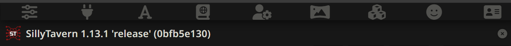
</div>

这是 SillyTavern 的“常用菜单栏”，从左到右依次是：

  - API 响应配置
  - API 连接
  - AI 回复格式化
  - 世界/知识书
  - 用户设置
  - 背景图片
  - 扩展
  - 用户角色管理
  - 角色管理

下面，请先点击第二个按钮 “API 连接” 将其中的 “API” 选项修改为 “聊天补全”，之后我们开始讲解整个 SillyTavern 的用户界面。

> 💡 注意！AI 大模型的发展十分迅速，哪怕是最新版的 SillyTavern 它的界面中仍然保留着一些陈旧或为了兼容性的设置。你可以把将它理解为一个在缝缝补补又在不断添砖加瓦的机器。有些选项可能很奇怪、很反常识，这是正常的。


---


<div style="text-align:center">
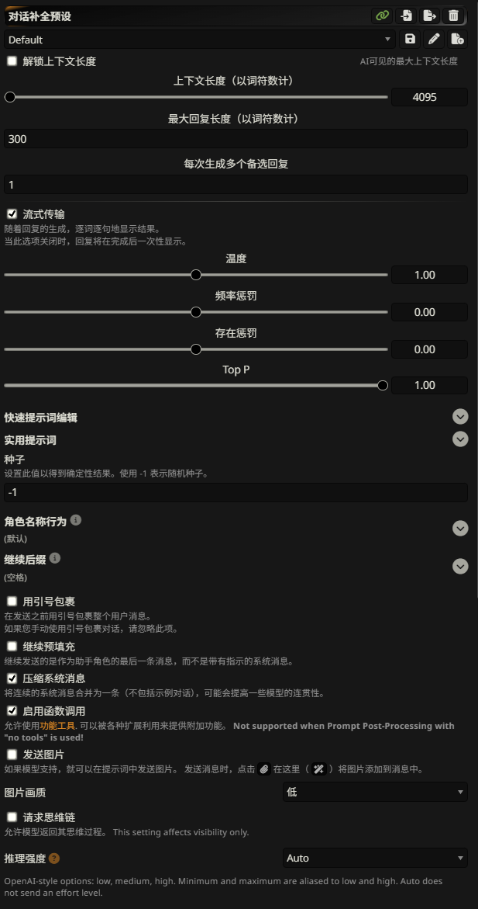
<p>API 响应配置 的 UI界面</p>
</div>

### API 响应配置

这是第一个按钮，也是我们的 “AI 调教控制器”。


**顶部 UI 界面**
  - 首先我们会看到顶部“对话补全预设”右边的“绿色锁链”按钮，它默认是打开的，开启状态下即默认将当前的预设绑定至“API 连接”
  - 剩下的按钮分别为：“导入预设”、“导出当前预设”、“删除当前预设”


**Default 部分**
  - 我们看到的 `Default` 是当前预设的名称，你可以点击展开列表选择更多
  - 右侧的按钮分别为：
    - “保存当前预设”：对于当前预设的任何修改都需要保存，当你切换预设之后，这些未保存的修改便会丢失
    - “修改预设名称”：直接修改当前预设的显示名称
    - “另存为”：将当前预设复制一份，以新的名称保存


**上下文部分**
  - 第一个选项“解锁上下文长度”，对于现代 AI 模型而言，这是一个`必选项`
  - “上下文长度”与“最大回复长度”：根据你将要在 `“API 连接”` 中配置的大模型而定，下面这张表格列举了常见大模型的这两个参数

    | 公司名称       | 模型名称                | 上下文长度 | 最大输出长度       |
    |----------------|-------------------------|------------|--------------------|
    | OpenAI         | GPT-4.1 / 4.1 Mini      | 1.05m      | 33k                |
    | OpenAI         | GPT-4o / 4o-mini        | 128k       | 16k                |
    | OpenAI         | GPT-4 Turbo             | 128k       | 4k                 |
    | Anthropic      | Claude Sonnet 4         | 200k       | 64k                |
    | Anthropic      | Claude Opus 4           | 200k       | 32k                |
    | Anthropic      | Claude 3.5 Haiku / Sonnet | 200k     | 8k                 |
    | Google         | Gemini 2.5 Pro / Flash  | 1.05M      | 66k                |
    | xAI            | Grok 4                  | 256k       | 256k               |
    | xAI            | Grok 3 / 3 Mini         | 131k       | 131k               |
    | DeepSeek       | DeepSeek-V3-0324        | 64k        | 4k / 8k            |
    | DeepSeek       | DeepSeek-R1-0528        | 64k        | 32k / 64k          |
    | ByteDance      | Doubao-1.5-pro-32k      | 128k       | 12k                |
    | ByteDance      | Doubao-1.5-pro-256k     | 256k       | 12k                |
    | Moonshot       | kimi-k2                 | 128k       | 32k                |

 - 备注：
    - 排名不分先后，国外模型为 OpenRouter 数据，国内模型为各官网数据，数据截止日期为 2025年7月
    - 1k = 1000 / 1M = 100000

 - “每次生成多个备选回复”：默认为`1`，调试时可适当增加
 - “流式传输”：开启此选项后 AI 会像打字一样进行输出，如遇截断或空回复可尝试关闭，一般保持`开启`


**模型输出控制**
  - “温度” - Temperature ：
    - 默认值： `1`
    - 控制 AI 输出时的“创造力”程度。
    - 调低会怎样： 回复更稳定，更符合逻辑，更“安全”，但可能更无聊和重复。
    - 调高会怎样： 回复更随机，更有创意，更出人意料，但也更容易跑题和胡说八道。

  - “频率惩罚” - Frequency Penalty ：
    - 默认值： `0`
    - 降低 AI 在一次回复中“重复使用同一个词”的倾向。
    - 调低会怎样： 变成复读机。
    - 调高会怎样： 避免重复用词直到无词可用，精神错乱，智械危机爆发，天网降临😊。

  - “存在惩罚” - Presence Penalty ：
    - 默认值： `0`
    - 鼓励 AI 在对话中“引入新话题或新概念”，而不是一直围绕已经提过的话题打转。
    - 调低会怎样： AI 会更倾向于保持在当前的话题上，进行更深入的探讨。
    - 调高会怎样： AI 会更有可能从一个话题跳到另一个话题，让对话内容更发散。如果太高，会导致对话缺乏连贯性，角色注意力不集中，东拉西扯。

  - “Top P” - 核心采样 : 
    - 默认值： `1` ，我的建议是 `0.95`
    - 在 AI 决定下一个词时，限制它的“备选词汇库”的大小。
    - 调低会怎样： AI 的“备选词汇库”非常小，只包含那些概率最高最可能的词。这会让回答变得非常可预测和“安全”，即使在高温下也不容易跑偏。
    - 调高会怎样： `1`是最大值，等于不设限。


**其他杂项**
  - “快速提示词编辑”和“使用提示词”：这部分是 SillyTavern 预置的 “提示词模板”，涉及到我们后续会讲到的“预设”，一般保持默认即可。
  - “种子”、“角色名称行为”、“继续后缀”：这里官方的中文说明已经很清晰，保持默认即可。
  - 接下来的几个选项：
    - 用引号包裹：已弃用功能
    - 继续预填充：这个的中文释义看起来比较绕，我们来看英文文本。

      ```
      Continue sends the last message as assistant role instead of system message with instruction.
      ```
      *将"继续提示" (Continue Nudge prompt) 作为 Assistant 消息而非 system 消息发送。启用此选项后，将不会使用"继续提示"预设文本。

    - 压缩系统消息：已弃用功能，请使用 `“API 连接”按钮 - “提示词后处理” 选项`

  - 有一个需要强调的是“推理强度”，这个东西当你在使用极为庞大的预设时，可能需要开到`中`或者`高`。


**提示词**
  - 就是大家常说的“预设”，现在，让我们就此打住，这部分内容，我们将会在后面单独一节课或者多节课来讲。


---


<div style="text-align:center">
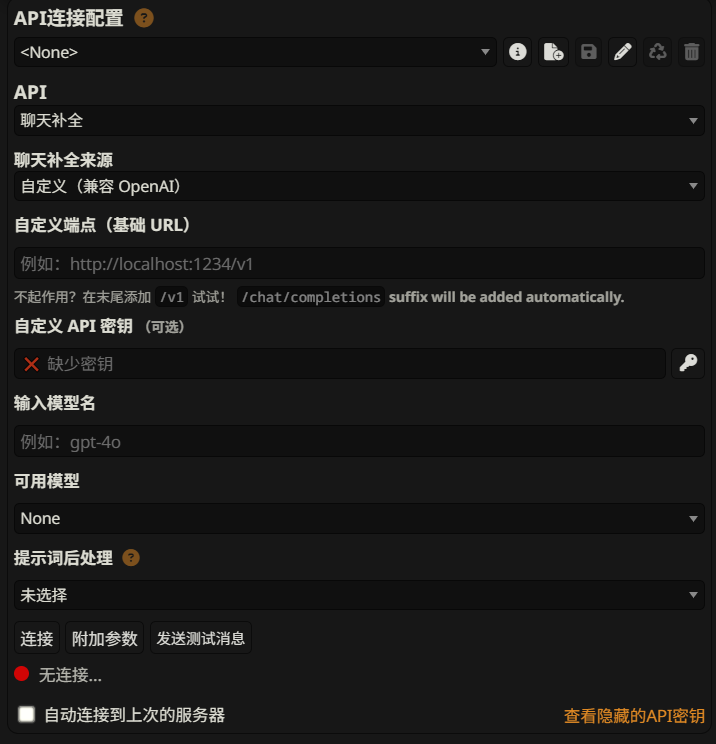
<p>API 连接 的 UI界面</p>
</div>

### API 连接

这是第二个按钮，也是 SillyTavern 的 “大脑”。

**API 详细配置**

  - 首先是 `API` 选项，它有以下这些参数，我们分别来说：
    - 文本补全 (Text Completion)： **目前不常用** / 一种比较传统和基础的 API 模式。把所有的对话历史、角色设定等信息打包成一个长长的文本，发送给 AI，然后 AI 在文本的末尾继续写下去，完成“补全”。
    - 聊天补全 (Chat Completion)： **目前主流** / 一种更现代、更强大的API模式，专为对话场景设计。绝大多数兼容 OpenAI API 格式的服务都可以跑。
    - NovelAI：**专业的角色扮演模型** / NovelAI.net ，有兴趣朋友可以尝试。
    - AI Horde：**布式的 AI 计算网络** / 由志愿者贡献出自己的电脑算力，组成一个“部落(Horde)”，免费给其他人提供AI模型推理服务。
    - KoboldAI：**KoboldCPP** / 本地安装(https://github.com/LostRuins/koboldcpp)，可以用它来加载 GGUF，但，我的朋友，你的显卡真的可以吗？**我从来都不推荐普通用户本地跑AI大模型，你的时间非常值钱，我的朋友**

  - 聊天补全来源： 内置了目前主流的 AI 服务商的`官方接口`，在列表里选择你的 API 提供商，然后填入 `KEY` 即可。如果你使用第三方中转或者本地架设了模型，请选择`自定义（兼容 OpenAI）`。

  - 自定义（兼容 OpenAI）：
    - 自定义端点（基础 URL）：API 链接地址，一般都是第三方的网址或你的本地地址。
    - 自定义 API 密钥：你在第三方获取到的 KEY。
    - 输入模型名/可用模型：在你填写正确的地址和 KEY 的情况下，点击底部的`连接`按钮，即可获取到`可用模型`列表，选择即可。如果没有获取到，在你的 API 提供商的网站去查找，然后填写即可。

**提示词后处理**

  这个我们需要单独来说，为了方便理解，我们假设原始的对话历史是这样的（这在某些 API 看来是“不规范的”）：

    ```
    System: 你是法外狂徒张三。
    User: 你好！
    User: 你有蓝火加特林吗？
    Assistant: 当然，我的蓝火加特林可猛了！
    Assistant: 呜！~哒哒哒哒哒！！！！
    ```

  记住上面的例子，然后我们一个一个来看：

  - None (默认)：不做任何特殊处理。SillyTavern 会以它内部的标准格式发送对话历史。大多数现代模型一般都不需要设置，除非你需要配合一些特殊`预设`。

  - NoTools.合并相同角色连续的发言：如果对话中有来自同一角色（比如用户）的连续多条消息，此选项会将它们合并成一条消息。
    ```处理后的效果
    System: 你是法外狂徒张三。
    User: 你好！你有蓝火加特林吗？
    Assistant: 当然，我的蓝火加特林可猛了！呜！~哒哒哒哒哒！！！！
    ```

  - NoTools.半严格: 包含“合并”功能且“强制角色交替”，且整个历史对话中只有一个系统提示词(多条会合并)，它的结构像这样：
    ```
    System > User > Assistant
    ```

  - NoTools.严格：包含“半严格”的所有功能，并且额外强制要求对话必须由用户消息开始（在系统提示词之后）。如果第一条非系统消息是 AI 的，它会自动在前面插入一条占位符用户消息。

    【原始对话】 
    ```
    System: 你是张三。 -> Assistant: 啊哈，我有蓝火加特林！
    ```
    【处理后】
    ```
    System: 你是张三。 -> User: [Start a new chat] -> Assistant: 啊哈，我有蓝火加特林！
    ```

  -  Single user message（notools）：单个用户消息，一般是用于一些上古模型或简单模型。它会把所有的东西全部拼在一起一次性发送给 AI，AI读完给你个回复。

  你肯定注意到了，在这些选项的上面，还有一个 `With Tools` 的大分类和一些选项。
  `with tools`会允许 AI 使用外部工具（例如，查询天气、进行计算、搜索网页）。在对话历史中，这会以一种特殊的格式存在。

  我们上面所说的且常用的都是 `No Tools` ，因为绝大多数 API 不支持工具调用，还有一点，支持工具调用的一般都很贵！希望过几个月能便宜些吧。

  > 💡 总结：一般保持 `none` ，特殊预设在说明文件里会建议你更改为什么模式。还有，如果你的连接报错了，看 SillyTavern 给你的报错提示，再去选择对应的模式即可。

**附加参数**

  在这里可以为当前连接的模型单独设置自定义参数，此处的参数优先级最高，可覆盖 **API 响应配置** 中的设置。对于特殊模型来说用处较大。

    - 包括主体参数：可以在这里添加任何 API 所支持的参数，有些参数 SillyTavern 的界面上没有提供相应的滑块或选项。
    - 排除主体参数：从 SillyTavern 默认将要发送的 API 请求主体中 移除 一个或多个参数。
    - 包含请求标头：向 API 请求添加自定义的 HTTP 标头 (Headers)。HTTP 标头是请求元数据的一部分，通常用于传递身份验证信息、路由指令或客户端信息，它不直接控制 AI 的文本生成逻辑。

**API 连接配置**

  最后，让我们回到顶部，在这里你可以将刚刚设置的所有的东西存储为`自定义名称`的预设配置。从左往右分别是 API预设名称、信息、新建预设、保存预设、编辑预设、重载预设（以连接信息重载）、删除预设。


---


<div style="text-align:center">
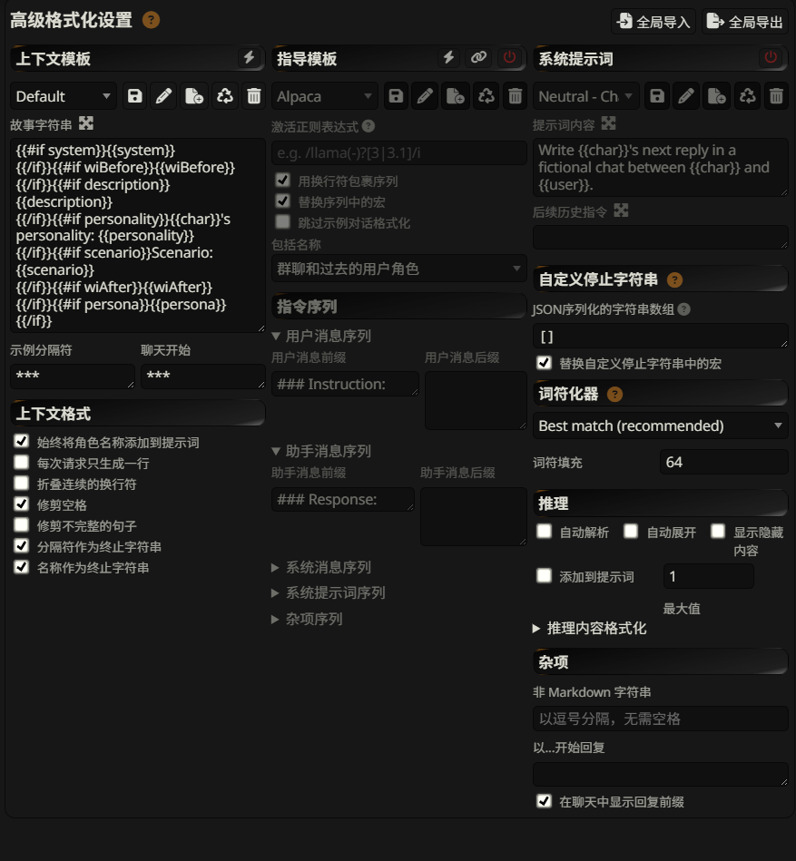
<p>高级格式化设置 的 UI界面</p>
</div>


### 高级格式化设置

  首先，这里的大部分东西都是给“文本补全”用的，而不是给“聊天补全”用的，所以我们只说“聊天补全”能用到的地方。

  - 上下文模板：**适用于文本补全**，这里不赘述。

    此处的 IF 判断我单独列了出来，并加了注释，现在不用去管它，后面的知识点会有联动。
    ```
    // 系统提示词 
    {{#if system}} {{system}} {{/if}}

    // 前置世界信息 - 预设 World Info (before) - 位置 World Info (↑Char)
    {{#if wiBefore}} {{wiBefore}} {{/if}}

    // 角色描述 - 预设 Char Description - 位置 Character Description
    {{#if description}} {{description}} {{/if}}

    // 角色性格 - 预设 Char Personality - 位置 Character Personality
    {{#if personality}} {{char}}'s personality: {{personality}} {{/if}}

    // 场景 - 预设 Scenario - 位置 Character Scenario
    {{#if scenario}}Scenario: {{scenario}} {{/if}}

    // 后置世界信息 - 预设  World Info (after) - 位置 World Info (↓Char)
    {{#if wiAfter}} {{wiAfter}} {{/if}}

    // 用户角色 - 预设 Persona Description - 位置 倒数第二个按钮
    {{#if persona}} {{persona}} {{/if}}
    ```

  - 指导模板/系统提示词：**适用于文本补全**，这里不赘述。
  
  - 自定义停止字符串：
    - 自定义 AI 禁词列表，即 AI 在生成回复时，一旦生成了这些内容，就会立刻停止。格式 `["A","B","C",...]` , 可以在 Jsonlint.com 中验证格式是否规范。
    - 注意！如果设置不当，会严重干扰 AI 的正常表达。
      - 比如你写了 `["\n"]` ，那么 AI 永远就只能输出一段话，当它需要换行时就会被 SillyTavern 终止。
      - 比如你写了 `["{{user}}"]` ，当 AI 使用你的名字时就会终止。
      - 我们来看一个更合理、更常见的设置： `["\n{{user}}:", " {{user}}:"]` 
        - AI完成了它作为角色的回复，比如：{{char}}："我明白了，我会按照你的指示去做。"
        - 在理想情况下，AI应该就此结束。但有些模型不够“聪明”，在生成了上面的回复后，它可能会错误地认为“现在轮到用户说话了”，于是它会接着生成： "\n{{user}}:" ，试图模仿你开始新一轮的对话。
        - 此时，"\n{{user}}:" 这个完整的字符串精确匹配了我们设置的停止符 AI 停止生成。
        - SillyTavern 接收到结果，发现结尾是停止符，于是自动把它剪掉。
        - 你最终看到的回复就是干净的："我明白了，我会按照你的指示去做。"

  - 词符化器：
    - 这个就是我们所谓的 AI 分词器
    - 下拉菜单 (Best match): 
      - 选择计算 Token 的方式。Best match (recommended) 会尝试自动匹配最适合当前模型的计算方法，以准确估算上下文长度。
    - Token Padding (词符填充): 
      - 安全缓冲值。如果上下文限制是 4096 个 token，这里设为64，那么 SillyTavern 会在上下文达到 4096-64=4032 个 token 时就开始裁剪旧消息，防止超出限制。

  - 推理：主要用于需要展示“思维链”时使用，勾选自动解析后修改具体标签格式，在此不赘述，

  - 杂项：
    - 非 Markdown 字符串：在这里填写的字符，在发送给AI时会被特殊处理，防止AI将其误解为 Markdown 格式。这是一个后端转义的功能，和你在前端输入的内容没有关联。
      - 在最新版的 SillyTavern 中通过测试，我并没有发现它正在起作用，也可能是我的使用方式有问题？

---


<div style="text-align:center">
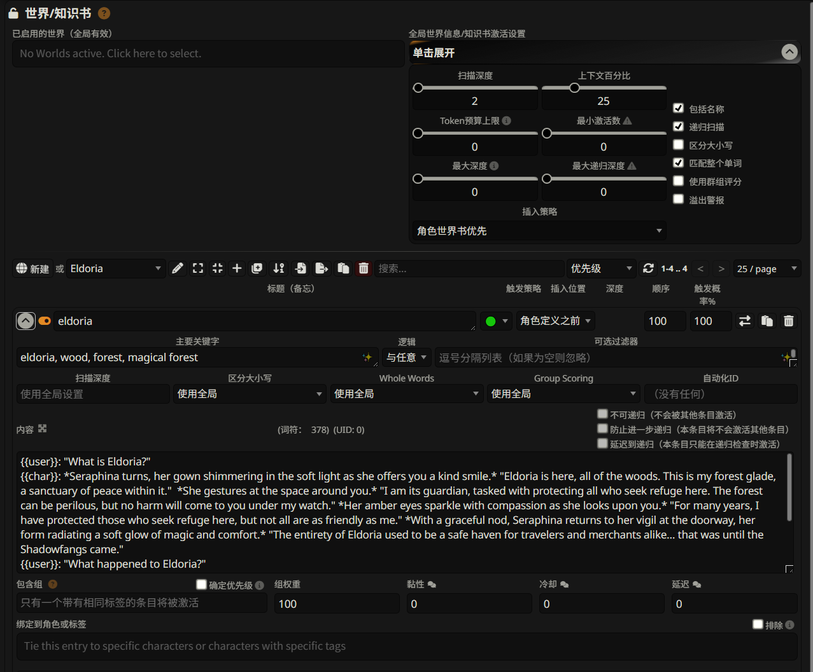
<p>世界/知识书 的 UI界面</p>
</div>


### 世界/知识书

**已启用的世界（全局有效）**

此区域位于界面最上方，用于选择在所有聊天中都生效的世界书文件。

- 作用:点击此区域可以选择一个或多个世界书文件，使其在任何角色或群组聊天中都处于激活状态。
- 用法:适用于定义通用世界观、物理法则、通用魔法体系等需要在所有情境下都保持一致的设定。

**全局世界信息/知识书激活设置**

用于设定所有世界书条目的**默认**激活规则。单个条目可以覆盖这些全局设置。

扫描深度 (Scan Depth):

  - 作用:设定系统在聊天记录中向前追溯多少条消息来寻找触发关键词。
  - 示例: `2` 表示扫描最近的 2 条消息。`0` 表示不扫描聊天记录，仅处理由其他条目递归触发的条目。

上下文百分比 / Token预算上限 (Context % / Budget):

  - 作用: 设定世界书内容总共可以占用多少 Token（文本单位）的上下文空间。可以是一个相对于总上下文的百分比（如`25%`），也可以是一个固定的Token 数。
  - 目的: 防止世界书内容占用过多空间，导致聊天记录被过早截断。超出预算的低优先级条目将不会被插入。

最小激活数 (Min Activations):

  - 作用: 设定一个最小触发数量。如果当前扫描深度内触发的条目数不足，系统会无视“扫描深度”限制，继续向更早的聊天记录回溯，直到满足此数量或达到“最大深度”。
  - 注意: 此功能与“最大递归深度”互斥。

最大深度 (Max Depth):

  - 作用: 配合“最小激活数”使用，为其回溯扫描设置一个最终的深度上限。

最大递归深度 (Max Recursion Steps):

  - 作用: 限制条目之间互相触发的“嵌套”层数。`0` 表示不限制层数，`1` 禁用递归，`2` 允许A触发B但B不能再触发C，以此类推。
  - 注意: 此功能与“最小激活数”互斥。

复选框设置:
  - `包括名称 (Include Names)`: 勾选后，扫描时会将消息发送者的名字（如 `{{user}}:`）也包含在内，允许使用角色名作为关键词。
  - `递归扫描 (Recursive Scan)`: 勾选后，一个被触发的条目的**内容**如果包含了另一个条目的**关键词**，那么另一个条目也会被触发。这是实现复杂逻辑和信息关联的核心功能。
  - `区分大小写 (Case-sensitive)`: 勾选后，关键词匹配时会严格区分大小写。
  - `匹配整个单词 (Match whole words)`: 勾选后，关键词只有在作为完整单词出现时才会被匹配。
  - `使用群组评分 (Use Group Scoring)`: 当同一“包含组”内的多个条目被触发时，此选项会让系统优先选择匹配到关键词数量最多的那个条目。
  - `溢出警报 (Alert on overflow)`: 如果激活的条目总大小超出了预算，会弹出一个提示。

插入策略 (Insertion Strategy):

  - 作用: 当你同时启用了**全局世界书**和**角色专属世界书**时，此设置决定它们的合并和排序方式。
    *   `角色世界书优先 (Character Lore First)`: 优先插入角色世界书的条目。
    *   `全局世界书优先 (Global Lore First)`: 优先插入全局世界书的条目。
    *   `均匀排序 (Sorted Evenly)`: 将所有条目视为一个整体，根据各自的“顺序 (Order)”值进行排序。

**世界书文件与条目管理**

  - `新建 / [文件名]`:** 切换、管理或新建世界书文件。

  - `重命名`: 重命名当前世界书文件。

  - `打开所有条目`：展开所有条目。

  - `关闭所有条目`：关闭所有条目。

  - `新条目`: 添加一个新的空白条目。

  - `使用关键词填充`：自动填充标题。

  - `应用当前排序作为顺序`：输入一个数字，按照当前文件顺序，以输入的数字为最大值依次递减重新编号。

  - `导入 / 导出`: 导入或导出世界书文件（JSON格式）。

  - `复制世界书`: 另存为工能。

  - `删除世界书`: 删除当前世界书

  - `搜索`: 在当前世界书的所有条目中进行搜索。

**单个世界书条目详解**

这是编辑每一个具体知识条目的核心区域。

标题与关键词：

  - 标题(备忘) (Memo): 仅为你自己提供的一个标签，方便识别，AI不可见。
  - 主要关键字 (Key):
    - 作用: 触发此条目的一个或多个关键词，用逗号隔开。这是触发的基础条件。支持正则表达式（格式如 `/regex/i`）。
    - 逻辑 (Logic) & 可选过滤器 (Optional Filter):
      - 作用: 一组附加的关键词（可选过滤器）和一套规则（逻辑），用于对“主要关键字”的触发进行精细化控制。
      - 逻辑选项:
        - `与任意 (AND ANY)`: 匹配至少一个**主要关键字** + 至少一个**可选过滤器**。
        - `与所有 (AND ALL)`: 匹配至少一个**主要关键字** + **所有**的**可选过滤器**。
        - `非任何 (NOT ANY)`: 匹配至少一个**主要关键字**，但**不能**匹配**任何**一个**可选过滤器**。（排除逻辑）
        - `非所有 (NOT ALL)`: 匹配至少一个**主要关键字**，但如果**所有**的**可选过滤器**都同时出现，则不触发。

条目核心设置：

  - 触发策略 (Strategy):
    - `🟢 (绿色圆圈)`: 默认，仅当关键词被匹配时激活。
    - `🔵 (蓝色圆圈)`: 恒定，无论有无关键词，条目始终被激活（只要世界书启用）。
    - `🔗 (链接图标)`: 向量化，允许通过语义相似度匹配（需`向量存储/Vector Storage`扩展）。
  - 插入位置 (Insertion Position):
    - 作用: 决定条目内容被插入到Prompt的哪个位置，位置越靠后（越接近当前聊天），影响力越大。
      - `角色定义之前/后 (Before/After Char Defs)`: 影响大，作为核心设定。
      - `示例消息之前/后 (Before/After Example Messages)`: 作为对话示例插入，影响AI说话风格。
      - `作者笔记顶部/底部 (Top/Bottom of AN)`: 作为元指令插入。
      - `@ D [深度]` : 作为一条“特定角色的”(系统/用户/AI助手)聊天消息插入到指定深度。`0`代表最底部（最新），影响力最强。
  - 顺序 (Order):
    - 作用: 数字，决定多个条目同时被触发时的插入优先级。**数字越大，优先级越高**，位置越靠后。
  - 触发概率% (Probability %):
    - 作用: 即使条目被触发，它也有一定概率不被插入。`100`表示必定插入，`50`表示一半几率。用于制造随机性。

  内容区与高级设置：

  - 扫描深度/区分大小写/Whole Words/Group Scoring：
      - 作用：对于上述全局设置的单独条目的覆盖设置。

  - 自动化ID (Automation ID):
      - 作用: 用于与“快捷回复”扩展中的STscript脚本联动。当条目激活时，拥有相同ID的脚本会自动执行。

  - 内容 (Content): 条目被激活时，这部分文本会被实际插入到AI的上下文中。

  - 递归控制 (Recursion Control):**
    - **不可递归 (Non-recursable):** 此条目**不能被其他条目激活**。它只能由原始的聊天记录触发。
    - **防止进一步递归 (Prevent further recursion):** 一旦此条目被激活，它的**内容将不会再去激活**任何其他条目。用于切断递归链。
    - **延迟到递归 (Delay until recursion):** 此条目**只能在递归检查时被激活**，即只能被其他已激活条目的内容所触发，对原始聊天记录免疫。用于构建知识层级。

    > 💡 注意：在这里你要能够明确区分 条目内容激活 和 聊天记录 是两个不同的概念

  - 包含组 (Inclusion Group):
      - 作用:** 如果多个拥有相同组标签的条目同时被触发，系统只会选择**其中一个**插入。
      - `确定优先级 (Prioritize Inclusion)`: 勾选后，会选择组内“顺序(Order)”值最高的那个，而不是随机选择。
      - `组权重 (Group Weight)`: 未勾选“确定优先级”时，权重越高的条目被随机选中的概率越大。
      - 时间效果 (Timed Effects):
        - `黏性 (Sticky)`: 条目被触发后，会保持激活状态 N 条消息。
        - `冷却 (Cooldown)`: 条目被触发后，在 N 条消息内无法再次被触发。
        - `延迟 (Delay)`: 聊天记录必须至少有 N 条消息时，此条目才能被激活。

  - 绑定到角色或标签 (Character/Tag Filter):
      - 作用: 让此条目只对某些特定角色或带有特定标签的角色生效。
      - `排除 (Exclude)`: 反转逻辑，使条目对**除了**指定的角色/标签之外的所有角色生效。


单独释义：向量存储匹配 (Vector Storage Matching)

这是一个替代关键词匹配的高级功能，由 `🔗 (链接图标)` 触发策略启用。关联到 `扩展` 中的 `Vector Storage`（向量存储） 插件（默认安装）。

  - 依赖:** 需要在“扩展”中启用 **Vector Storage** 并进行正确配置。
  - 原理:** 它不是通过查找精确的关键词，而是通过AI模型计算**最近聊天内容**与世界书条目**“内容 (Content)”**之间的**语义相似度**来决定是否激活。
  - 优点:** 即使你没有使用确切的关键词，只要聊天的意思相近，条目也可能被激活。例如，一个关于“悲伤”的条目，可能会在你描述“失落”、“沮丧”或“流泪”时被激活。
  - 缺点:** 结果不如关键词精确可控，有时可能会有意外的触发。
  - 注意:**
      *   它的扫描范围不遵循世界书的“扫描深度”，而是使用 Vector Storage 扩展中自己的“查询消息数 (Query messages)”设置。
      *   所有其他的过滤条件（如触发概率、角色过滤器、包含组等）依然有效。

> 📚 小课堂 `中间塌陷 Lost in the Middle` 与 `Mamba、TTT 、Transformer` 见视频版 

> 💡 如何写好长文本提示词
      1.重要信息放两端
      2.使用结构化标记
      3.重复关键指令


---


<div style="text-align:center">
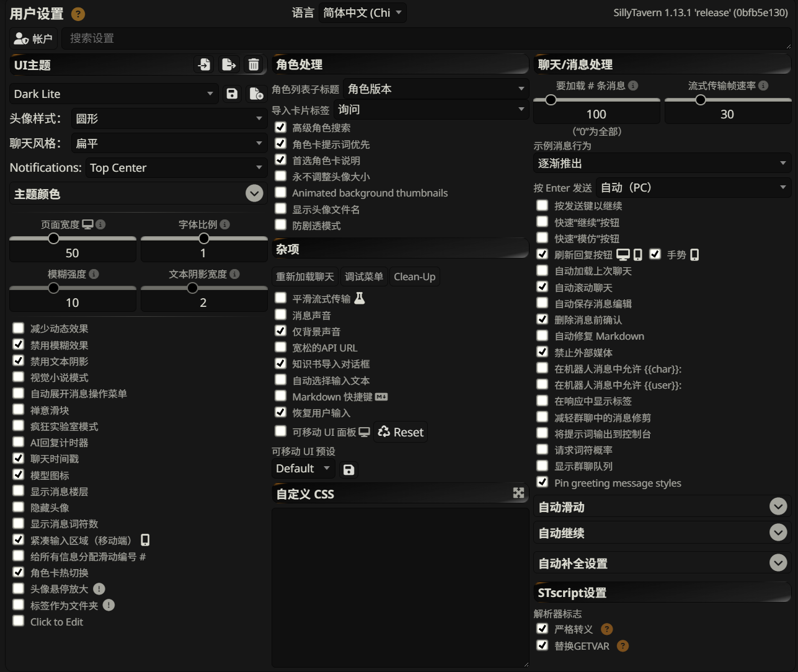
<p>用户设置 的 UI界面</p>
</div>

### 用户设置

**顶部栏（Top Bar）**

- **语言 (Language)**：在这里选择 SillyTavern 界面的显示语言。注意，这只影响 UI 文本，不影响与 AI 的对话内容。如需翻译聊天内容，请使用 `聊天翻译` 扩展。
- **软件版本 (Software Version)**：右上角显示的 `SillyTavern 1.13.1 'release' (0bfb5e130)` 是当前的版本号。在寻求帮助或报告问题时，提供这个信息至关重要。
- **账户 (Account)**：点击人像图标，可以管理账户信息、创建和恢复设置快照、下载包含所有用户数据（角色、聊天记录等）的完整备份，以及修改密码。在多用户模式下，管理员还可以管理其他用户。
- **搜索设置 (Search Settings)**：可以快速定位到需要的设置项。

**UI 主题 (UI Theme)**

- 标题右边分别是 导入/导出/删除
- 当前主题的名称 / 保存 / 另存为
- 主题 (Theme)：`Dark Lite` 是默认的深色主题。你可以从下拉菜单中选择其他内置主题，也可以下载其他的作者编写的第三方主题。
- 头像样式 (Avatar Style)：设置角色和用户头像的形状。
- 聊天风格 (Chat Style)：调整聊天气泡的视觉风格。
- Notifications: 设置通知（如“已连接到 API”）在屏幕上的弹出位置，例如“Top Center”（顶部居中）。
- 主题颜色 (Theme Color)：点击色块可以自定义界面的主色调。
- 页面宽度 (Page Width) 和 字体比例 (Font Scale)：通过滑块调整聊天界面的整体宽度和文字大小，以适应你的屏幕和阅读习惯。
- 模糊强度 (Blur Strength) 和 文本阴影宽度 (Text Shadow Width)：调整背景模糊和文字阴影效果的强度，增加界面的层次感。

复选框选项：

- 减少动态效果 (Reduce dynamic effects)：禁用一些非必要的动画，提升在低性能设备上的流畅度。
- 禁用模糊效果 (Disable blur effect) / 禁用文本阴影 (Disable text shadow)：彻底关闭模糊和阴影，追求极简或极致性能。
- 视觉小说模式 (Visual Novel mode)：一个核心功能。启用后，聊天界面会像视觉小说游戏一样，在对话旁边显示角色的立绘（Sprites）。你可以在角色卡中为不同情绪设置不同的立绘。
> 📚 小课堂 `视觉小说模式` 见视频版 
- 聊天时间戳 (Chat Timestamps)：在每条消息旁边显示发送时间。
- 模型图标 (Model Icon)：在聊天界面显示当前使用的 AI 模型图标。
- 显示消息楼层 (Show message floors)：为每条消息显示一个编号（#1, #2, ...）。
- 隐藏头像 (Hide Avatars)：在聊天中隐藏用户和角色的头像。
- 显示消息词符数 (Show message token count)：显示每条消息消耗的 Token 数量。
- 紧凑输入区域 (移动端) (Compact Input Area (Mobile)): 在移动设备上使用更紧凑的输入框布局。
- 双击编辑 (Click to Edit): 双击消息可直接编辑

角色处理 (Character Handling)：

- 管理角色卡的导入、显示和行为。
- 角色列表子标题 (Char List Subheader)：在角色选择列表中，除了角色名外，额外显示的信息。可以选择“角色版本”或“创建者”。
- 导入卡片标签 (Import Card Tags)：导入新角色卡时如何处理其附带的标签。
    - 询问 (Ask)：每次都弹窗询问。
    - 无 (None)：不导入任何标签。
    - 全部 (All)：导入所有标签。
    - 现有 (Existing)：只导入那些你已经创建过的标签。
- 高级角色搜索 (Advanced Character Search)：启用后，搜索角色时会使用更智能的模糊匹配，并且会搜索角色卡的所有字段，而不仅仅是名字。
- 角色卡提示词优先 (Prefer Char. Prompt)：如果角色卡内定义了独立的“系统提示词”，优先使用它，覆盖全局设置。见`角色卡高级设置`-`提示词覆盖`。
- 首选角色卡说明 (Prefer Char. Instructions)：如果角色卡内定义了独立的“后历史记录指令”，优先使用它。见`角色卡高级设置`-`提示词覆盖`。
- 永不调整头像大小 (Never resize avatars)：应该翻译为“不调整头像大小”。禁止在导入时自动裁剪或缩放角色头像。关闭此项时，图片会被统一调整为 512x768 像素。
- 显示头像文件名 (Show avatar filenames)：应该翻译为“显示角色卡文件名”。在角色列表中显示角色卡的原始文件名。
- 防剧透模式 (Spoiler Free Mode)：关联`角色卡`中的`创作者的注释`-`显示/隐藏描述和第一条消息`。

聊天/消息处理 (Chat/Message Handling)：

- 这是与 AI 互动体验最相关的部分，控制着消息的加载、发送和管理。
- 要加载 # 条消息 (# Messages to Load)：设置每次进入聊天时加载的历史消息数量。`0` 代表加载全部。如果你的聊天记录非常长，设置一个较小的数字（如 100）可以显著加快加载速度。
- 流式传输帧速率 (Streaming FPS)：流式传输渲染速度，AI 回复以“打字机”效果出现时的刷新率。数值越高，文字出现得越平滑，但对性能要求也稍高。
- 示例消息行为 (Example Messages Behavior)：控制角色卡中的“示例对话”如何影响聊天。
    - 逐渐推出 (Gradual push-out)：示例对话会随着新消息的增加而逐渐被“挤出”上下文。
- 按 Enter 发送 (Enter to Send)：设置 Enter 键的功能。
    - 自动 (PC) (Automatic (PC)): 在电脑上，按 Enter 发送消息；按 Shift+Enter 换行。
    - 启用 (Enabled): 总是按 Enter 发送。
    - 禁用 (Disabled): Enter 键只用于换行。
- 快速“继续”按钮 (Quick "Continue" button)：在输入框的右边显示一个“继续”按钮，让 AI 接着写。
- 快速“模仿”按钮 (Quick "Impersonate" button)：在输入框的右边显示一个“AI帮答”按钮，让 AI 帮你生成回复内容。
- 刷新回复按钮 / 手势 (Swipes / Gestures)：启用后，可以在 AI 的回复旁边看到左右箭头，用来切换由 AI 生成的不同版本的回复。在移动端也支持手势滑动。
- 自动化与管理 (Auto-Management):
- 自动加载上次聊天 (Auto-load Last Chat)：启动 SillyTavern 时自动打开你最后一次的聊天。
- 自动滚动聊天 (Auto-scroll Chat)：收到新消息时，聊天窗口自动滚动到底部。
- 自动保存消息编辑 (Auto-save Message Edits)：编辑消息后，无需确认直接保存。
- 删除消息前确认 (Confirm message deletion)：删除消息时会弹出确认框，防止误删。
- 自动修复 Markdown (Auto-fix Markdown)：自动修正 AI 回复中不规范的 Markdown 语法（如修复未闭合的 `*` 或 `**`）。
- 禁止外部媒体 (Forbid External Media)：阻止聊天中加载来自外部网站的图片或媒体，增强安全性。
- 在机器人消息中允许 `{{char}}` / `{{user}}`: 如果 AI 在生成回复时包含了 `{{char}}:` 或 `{{user}}:` 这样的前缀，选择是否在最终显示时保留它们。
- 减轻群聊中的消息修剪 (Relax message trim in Groups)：在群聊中，允许 AI 为其他角色发言，而不是在检测到非当前发言角色时停止生成。
- 显示群聊队列 (Show group chat queue)：在群聊时，在角色列表中显示角色的发言顺序。
- Pin greeting message styles: 即使角色的问候语因为“懒加载”(Lazy loding)而未在屏幕上显示，也始终应用其包含的样式标签。
> 额外说明：为了提高性能，当你的聊天记录变得非常长时，SillyTavern 不会一次性把成百上千条消息都加载到屏幕上。它只会加载最近的一部分消息（数量由“要加载 # 条消息”设置决定）。当你向上滚动时，它才会去加载更早的消息。这个机制就叫“懒加载”。
问候语是聊天的第一条消息。在一个很长的对话中，当你向下滚动时，这条问候语很快就会被“卸载”掉，因为它不在最近的消息范围内了。如果这条问候语里包含了定义样式代码，那么当它被卸载后，这个样式规则就会失效，后续消息的格式可能会变回默认状态，导致视觉不一致。
- 将提示词输出到控制台 (Log prompts to console)：一个调试功能，会将发送给 AI 的完整提示词打印在浏览器的开发者控制台（F12）中。
- 请求词符概率 (Request token probabilities)：请求 API 返回每个词符（token）的生成概率，可用于高级分析。

杂项 (Miscellaneous)：

- 重新加载聊天 (Reload Chat)：强制刷新当前的聊天界面。
- 调试菜单 (Debug Menu)：**（高级用户）** 提供一系列用于故障排查和数据维护的工具，如清除缓存、刷新统计等。除非你清楚自己在做什么，否则请谨慎使用。
- Clean-Up (清理)：清除缓存，可以扫描并删除未被使用的文件（如已删除角色的聊天记录、未在任何聊天中引用的图片等），帮助你释放磁盘空间。**警告：删除是永久性的，无法撤销！**
- 平滑流式传输 (Smooth Streaming)：一个实验性功能，旨在让流式输出的文本更流畅。
- 消息声音 (Message Sound)：当 AI 完成回复时播放提示音。可以设置为仅在浏览器标签页未激活时播放（**仅背景声音**）。
- 知识书导入对话框 (Lorebook Import Dialog)：当导入的角色卡内嵌有世界信息（知识书）时，弹出导入对话框。
- 自动选择输入文本 (Auto-select Input Text)：点击某些输入框时，自动全选其中的文本。
- Markdown 快捷键 (Markdown Hotkeys)：启用 `Ctrl+B` (粗体), `Ctrl+I` (斜体) 等键盘快捷键来格式化文本。
- 恢复用户输入 (Restore User Input)：刷新页面后，保留输入框中未发送的文本。
- 可移动 UI 面板 (MovingUI)：**这个选项不是自由移动!!!**允许你通过拖拽来设置界面上的各个面板大小（如角色、设置等）。旁边有 **Reset** 按钮可以恢复默认布局。

STscript 设置 (STscript Settings)：
- 这些是针对 SillyTavern 内置脚本语言 STscript 的高级解析器设置，主要面向开发者或高级角色卡创作者。普通用户通常无需更改。
- 严格转义 (Strict Escaping / STRICT_ESCAPING)：改变脚本中特殊字符（如 `|` 和 `\`）的处理方式。
- 替换GETVAR (Replace GETVAR / REPLACE_GETVAR)：改变变量宏的替换方式，以避免当变量值本身包含宏时发生意外的二次替换。

> 📚 小课堂 `严格转义` 和 `替换GETVAR` 见视频版 

<div style="text-align:center">
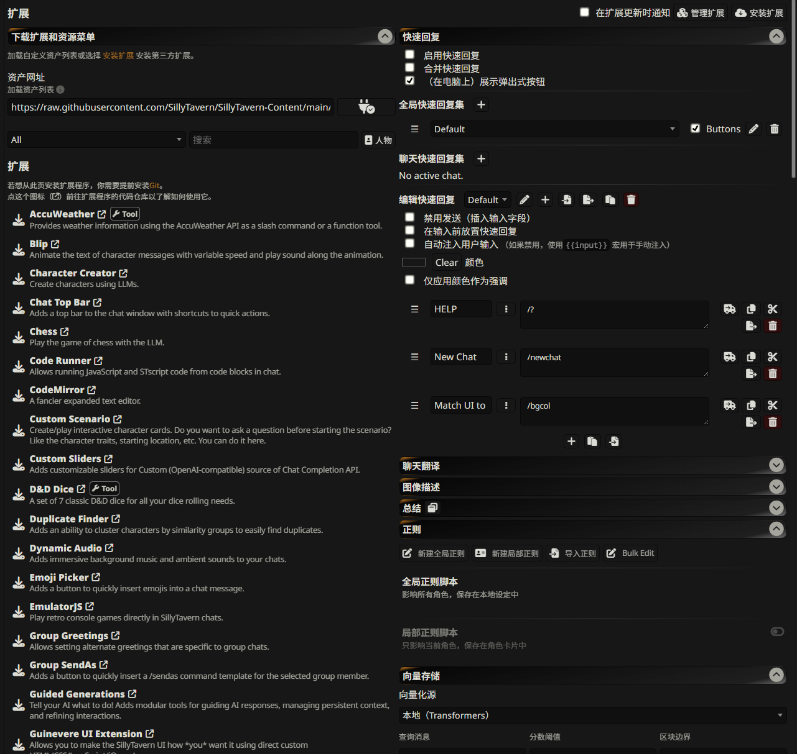
<p>扩展 的 UI界面</p>
</div>

### 扩展

先来看顶部右上角的图标：

<div style="text-align:center">
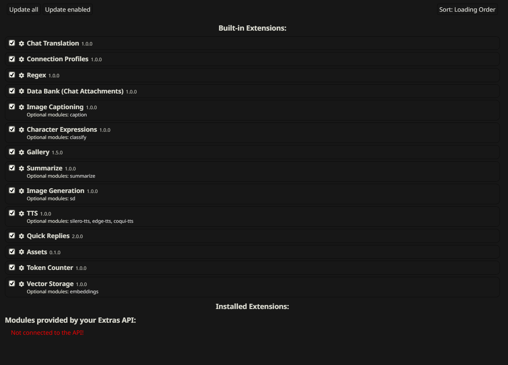
<p>管理扩展 的 UI界面</p>
</div>

管理扩展 (Manage extensions)
功能：这是管理所有已安装扩展的核心界面。在这里，您可以启用（打勾）或禁用（取消打勾）扩展，以及更新它们。

<div style="text-align:center">
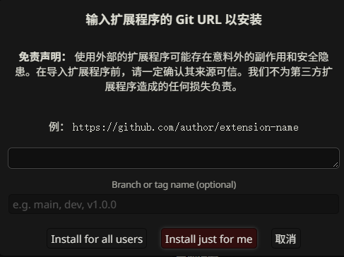
<p>安装扩展 的 UI界面</p>
</div>

安装扩展 (Install extension)
功能：用于安装来自 Git 仓库的第三方扩展。这为您提供了极大的灵活性，但同时也伴随着安全风险。

下载扩展和资源 (Download Extensions & Assets)：这是官方推荐的、安装新扩展和社区资源的主要入口。您可以从这里安全地下载由 SillyTavern 官方或社区维护的扩展、角色卡、音效、背景图等。

**内置扩展**

- Expression Images (角色表情)：根据对话内容，在聊天窗口旁显示角色的不同表情立绘（也称 'sprites'）。

- Image Generation (图像生成)/ 图像提示模版：连接 Stable Diffusion、DALL-E 等 API，在聊天中生成图片。
- Text To Speech (TTS, 文本转语音)：使用多种语音引擎为角色的回复配音。
- 快速回复：可在此处设置显示在用户输入框上方的快捷回复按钮。
> 📚 小课堂 `自动构建快速回复` 见视频版 
- Chat Translation (聊天翻译)：将聊天消息实时翻译成不同语言。
- Quick Reply (快速回复)：允许您通过单击按钮快速发送预设回复或执行命令。第一张截图的右侧展示的就是“快速回复”扩展的设置界面。
- 正则：自定义文本替换正则。
> 📚 小课堂 `自动构建正则` 见视频版 

<div style="text-align:center">
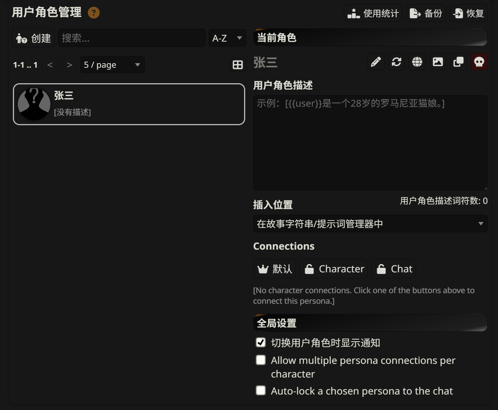
<p>用户角色管理 的 UI界面</p>
</div>

### 用户角色管理

左侧：角色列表与创建

- 创建 (Create)：点击此按钮以创建一个新的、空白的用户角色。您需要为它指定一个名称。
- 搜索框 (Search)：当您的用户角色数量增多时，可以在此输入关键词快速查找。
- A-Z 排序：对角色列表进行字母排序。
- 角色列表：这里会列出您所有的用户角色。点击其中一个，即可在右侧查看和编辑其详细信息。图中我们选择了一个名为“张三”的角色。

右侧：当前角色详情

- 张三：显示当前选定角色的头像和名称。
- 快捷操作图标：
    - ✏️ (Rename Persona / 编辑)：重命名此角色。
    - 🔄 (Sync / 同步)：将当前聊天中的所有**您的**发言，都归属到当前这个用户角色名下。如果您在聊天中途切换了角色，想让之前的发言也统一为新角色的身份，就使用这个功能。
    - 🌐 (绑定世界书)：为当前用户角色导绑定已有的世界书。
    - 🖼️ (Change Persona Image / 更改图片)：为当前角色设置或更换头像。
    - ❐ (Duplicate / 复制)：复制当前的用户角色，创建一个新的、内容完全相同的角色。
    - 💀 (Delete / 删除)：删除当前选定的用户角色。
- 用户角色描述 (Persona Description)：
    - 这段描述会被插入到发送给 AI 的提示词 (Prompt) 中，让 AI 知道它在和“谁”对话。
- 插入位置 (Position)：
  - 在故事字符串/提示词管理器中 (In Story String / Prompt Manager)**：这是默认选项，也是最常用的。描述会作为主要上下文的一部分。
  - 作者笔记顶部/底部 (Top/Bottom of Author's Note)**：将描述添加到作者笔记的顶部或底部。
  - 聊天的特定深度 (In Chat @ Depth)**：和 @D 的设置相同。
  - 无 (None / disabled)**：禁用此功能，不将描述插入提示词。

关联 (Connections)

- 能让 SillyTavern 在特定情况下自动为您选择某个用户角色。
- 👑 默认 (Default)：将此角色设置为**默认用户角色**。当没有其他任何锁定规则生效时，SillyTavern 会自动使用这个角色。默认角色在列表中会有一个黄色边框。只能有一个默认角色。
- 🔓 Character (角色锁定)：将此用户角色**锁定到当前的AI角色**。未来只要您和这个特定的AI角色聊天，就会自动切换到这个用户角色。
- 🔓 Chat (聊天锁定)：将此用户角色**锁定到当前的这个聊天会话**。未来只要您打开这个特定的聊天记录，就会自动切换到这个用户角色。

全局设置 (Global Settings)

这里的设置会影响所有用户角色的行为，是全局性的。

- 切换用户角色时显示通知 (Show notifications on switching personas)：勾选后，当因为锁定规则自动切换角色时，屏幕右上角会弹出提示消息。
- Allow multiple persona connections per character (允许单个AI角色连接多个用户角色)：
    - 不勾选 (默认)：一个AI角色只能锁定一个用户角色。当您为一个AI角色锁定新的用户角色时，旧的锁定会自动解除。
    - 勾选：您可以将多个用户角色同时锁定到同一个AI角色上。这样，每次您与该AI角色开始新聊天时，系统会弹出一个窗口，让您选择本次聊天要使用哪个用户角色。
- Auto-lock a chosen persona to the chat (自动将选定的用户角色锁定到聊天)**：
    - 勾选：当您（手动或自动）选择了一个用户角色后，该角色会自动与当前聊天会话进行“聊天锁定”。这非常有用，特别是当您启用了“允许多角色连接”时，可以在选择一次后就固定下来，不必每次都选。


---

<div style="text-align:center">
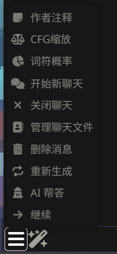
<p>菜单栏 的 UI界面</p>
</div>

<div style="text-align:center">
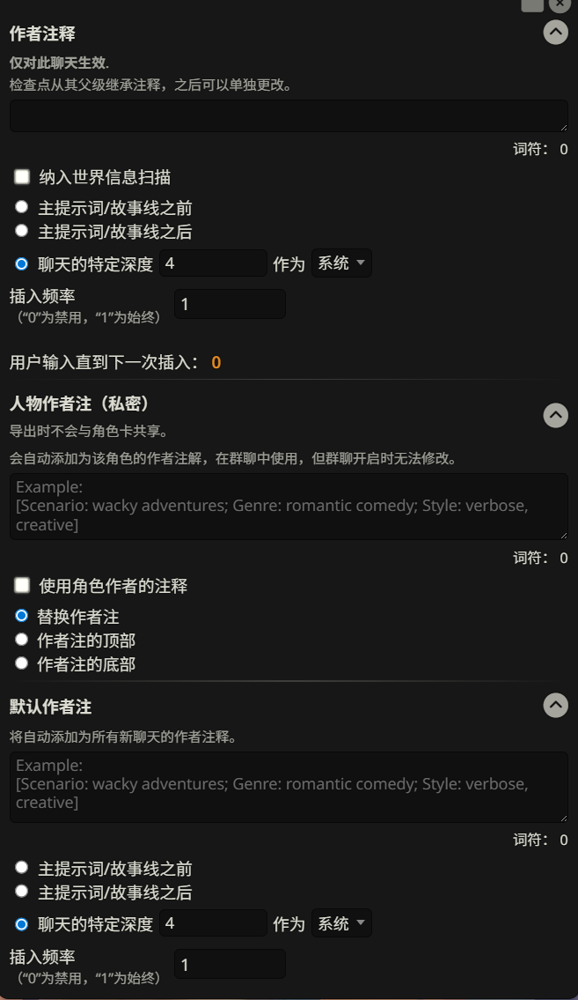
<p>作者注释 的 UI界面</p>
</div>


### 作者注释 (Author's Note / A/N)

位于用户聊天框左侧第一个菜单栏内

**作者注释**，简称A/N，是一个功能强大的“临时小纸条”。它允许你在不修改角色卡本身的情况下，将一段自定义文本（如指令、场景描述、风格要求等）插入到发送给AI的上下文（Prompt）中的几乎任何位置。

它的主要作用是**在对话过程中对AI进行提醒、补充设定或施加临时规则**。

**A. 作者注释 (本次聊天)**

这部分设置**仅对当前聊天生效**，关闭或重置聊天后就会失效。

- 文本框: 在这里输入你希望插入的内容。
    - 示例1 (风格控制): `[Style: descriptive, verbose, use detailed sensory language]`
    - 示例2 (行为指令): `[Instructions: {{char}} should act nervous and avoid eye contact with {{user}}]`
    - 示例3 (场景补充): `[Scene: The room is cold, a single candle flickers on the table, casting long shadows]`
- 位置 (Placement): 决定这张“小纸条”贴在哪里。
    - 主提示词/故事线之前 (After Scenario): 将注释放在角色设定的“场景/Scenario”部分之后，但在聊天示例（Example Messages）之前。这适合设置全局性的、贯穿整个对话的背景或规则。
    - 主提示词/故事线之后: 同样是放在上下文的靠前位置。
    - 聊天的特定深度 (In-chat Depth): 这是最常用也最强大的选项。它将注释直接插入到最近的聊天记录中。
        - 深度（Depth）: 数字代表从下往上数的位置。
            *   `深度 0`: 插入到上下文的**最末尾**，紧跟在你的最新输入之后。这是**影响力最强**的位置，因为AI会优先关注最近的信息。
            *   `深度 4`: 插入到最近的4条消息之前。
        - 核心原则: **注释在上下文中的位置越靠后（越接近底部），对AI下一次回复的影响力就越大。**
- 插入频率 (Frequency): 控制注释多久出现一次。
    *   `0`: 禁用，永不插入。
    *   `1`: **每次**你发送消息时都插入。这是最常用的设置，用于持续性的指令。
    *   `4`: 每隔4次用户输入后插入一次。适用于需要偶尔提醒的指令。
- 纳入世界信息扫描 (Include in World Info scan): 勾选后，世界信息（Lorebook）的关键词也会扫描作者注释里的内容，可能会触发相关的世界信息条目。

**B. 人物作者注 (私密) (Character Author's Note)**

这个注释是**保存在角色卡文件中的**，但它是**私密的**，意味着导出为公共角色卡（如PNG）时不会被包含。

- 主要用途: 在群聊（Group Chat）中极为有用。你可以为每个角色设置不同的私密作者注，当轮到该角色发言时，这个注释就会生效，引导其做出符合当前情景的独特行为。
- 位置: 通常只有“顶部”和“底部”选项，决定了它在角色发言的上下文中是靠前还是靠后。

**C. 默认作者注释 (Default Author's Note)**

这是一个**模板**。在这里设置的内容，会自动应用到所有**新创建的聊天**中。这非常方便，如果你有一些对所有角色都通用的写作风格要求（比如要求使用引号表示对话，用星号表示动作），就可以在这里一劳永逸地设置好。它的设置选项与“本次聊天”的作者注释完全相同。


<div style="text-align:center">
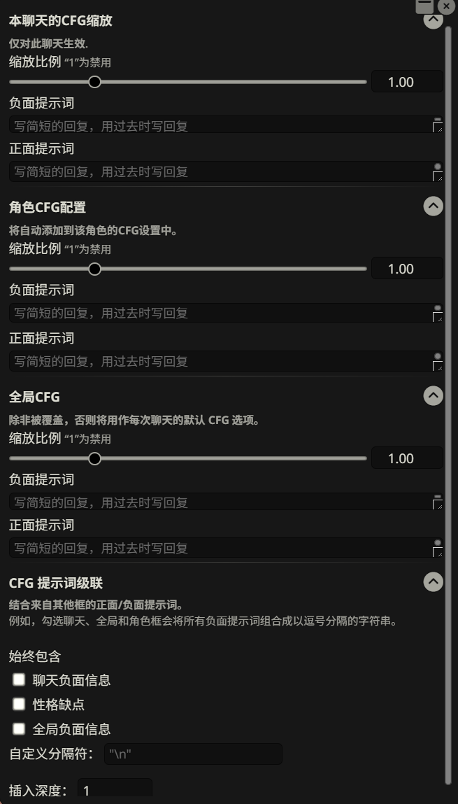
<p>CFG 的 UI界面</p>
</div>


### CFG (Classifier-Free Guidance)

**CFG**，全称“无分类器指导”，是一种更高级、更“硬核”的AI引导技术。它并非像作者注释那样简单地“添加”文本，而是通过一种“**提示词混合**”的原理来工作。

你可以把它想象成一个“拉扯”AI思维方向的拔河比赛：

- 正面提示词 (Positive Prompt): 你希望AI表现出的特质（比如“开心”、“话多”）。
- 负面提示词 (Negative Prompt): 你不希望AI表现出的特质（比如“悲伤”、“重复”）。

CFG会分析这两个提示词的差异，并将AI的生成结果向“正面”拉，同时远离“负面”。

**重要警告**: **与Stable Diffusion不同**: 它不是简单的关键词排除，而是一种更复杂的语义引导。

**A. 三个配置层级 (Scopes)**

CFG提供了三个层级的配置，优先级从低到高：

1.  **角色CFG配置 (Character CFG)**: 设置保存在角色卡中，针对该角色的特定倾向进行引导。例如，某个角色天生害羞，你可以在这里设置负面提示词 `[talkative, bold]` 来抑制他变得过于外向。
2.  **本次聊天的CFG缩放 (Chat CFG)**: 仅对当前聊天生效，优先级高于角色CFG。适合根据当前剧情发展进行临时调整。
3.  **全局CFG (Global CFG)**: **最高优先级**，会覆盖前面所有的CFG设置，甚至会覆盖模型预设中的CFG。这是一个“一刀切”的强大工具，慎用。

**B. 核心参数**

每个层级都有以下三个核心参数：

- 缩放比例 (Scale): 这是CFG效果的强度控制器。
    *   `1`: **禁用CFG**。SillyTavern不会发送任何CFG指令。
    *   `> 1`: **正常模式**。数值越大，AI就越会努力遵循“正面提示词”并避开“负面提示词”。官方文档建议从 `1.5` 开始尝试，然后根据效果上下微调。过高的值可能导致输出扭曲、不自然。
    *   `< 1`: **反转模式**。AI会反过来，努力遵循“负面提示词”并避开“正面提示词”。这可以用来创造一些特殊效果，比如让一个快乐的角色突然变得悲伤。
- 负面提示词 (Negative Prompt): 告诉AI要**避免**什么。
    - 示例: 假设角色“John”本应是快乐的，但总表现出悲伤。
    - 负面提示词: `[John's feelings: sad, depressed, unhappy]`
- 正面提示词 (Positive Prompt): 告诉AI要**强化**什么。这是可选的，但与负面提示词配合使用效果更佳。
    - 示例 (续上):
    - 正面提示词: `[John's feelings: happy, joyful, excited]`

**C. CFG提示词级联 (Prompt Cascading)**

这是一个高级功能，用于**组合**来自不同层级（聊天、角色、全局）的提示词。

- 勾选框: 你可以选择将哪些层级的正面/负面提示词合并在一起。例如，你可以同时启用“聊天负面信息”和“全局负面信息”，系统会将它们用分隔符连接成一个更长的负面提示词。
- 自定义分隔符: 定义合并提示词时使用的字符，默认为换行符 `\n`。
- 插入深度 (Insertion Depth): 与作者注释的深度类似，决定了最终组合好的CFG提示词插入到上下文的哪个位置。同样遵循**越靠后影响越大**的原则。官方文档建议在普通聊天中使用默认深度 `1`。


---

<h2 align="center">Part.2 深入后台：了解 config.yaml</h2>

在你成功体验了 SillyTavern 的核心乐趣后，如果你想进行一些界面上无法完成的高级设置，那么是时候了解一下它的“神经中枢”——配置文件了。

最重要的配置文件叫做 `config.yaml`，它位于你的 SillyTavern 安装根目录下。

> **⚠️ 注意：** `config.yaml`会在初次运行时创建，修改任何 `.yaml` 文件时，请使用专业的文本编辑器，如 **VS Code**、**Sublime Text** 等。**不要使用 Windows 自带的记事本**，它可能会破坏文件的格式！

让我们来看几个最常用的配置项：

### 1. 修改访问端口

默认情况下，SillyTavern 运行在 `8000` 端口上。如果这个端口被其他程序占用了，你可以在 `config.yaml` 中找到 `SERVER CONFIGURATION` 分区并修改它。

```yaml
# -- SERVER CONFIGURATION --
# ... (其他设置) ...
# Server port
port: 8000
```
比如，你可以把它改成 `8080` 或其他未被占用的端口。

### 2. 开启局域网共享

想在同一 WiFi 网络下的手机、平板或其他电脑上使用你主机上的 SillyTavern 吗？你需要开启局域网（LAN）共享。找到 `listen` 选项，将 `false` 改为 `true`。

```yaml
# -- SERVER CONFIGURATION --
# Listen for incoming connections
listen: false
```
改为：
```yaml
# Listen for incoming connections
listen: true
```
保存并重启 SillyTavern 后，你就可以在其他设备上，通过 `http://<你电脑的局域网IP>:<端口号>` 来访问了。（例如: `http://192.168.1.101:8000`）

> **💡 进阶提示：** 配置提供了更精细的控制。在 `listen: true` 的下方，你还可以通过 `protocol` 设置来决定是启用 `ipv4` 还是 `ipv6`。对于绝大多数家庭网络环境，默认设置（`ipv4: true`, `ipv6: false`）就是最佳选择，无需改动。

### 3. 设置网络代理

如果你需要通过代理来连接 AI 的 API（例如 OpenAI 或其他海外服务），新版配置提供了专门的 `requestProxy` 区域。这比旧版更加强大。

找到 `REQUEST PROXY CONFIGURATION` 分区。你需要做两步操作：

1.  将 `enabled` 的值从 `false` 改为 `true`。
2.  在 `url` 字段中填入你的代理地址。

例如，一个本地的 HTTP 代理通常是 `http://127.0.0.1:端口号`。修改后的配置如下：

```yaml
# -- REQUEST PROXY CONFIGURATION --
requestProxy:
  # If a proxy is enabled, all outgoing HTTP/HTTPS requests will be routed through it.
  enabled: true
  # Proxy URL. Possible protocols: http, https, socks, socks5, socks4, pac
  url: "http://127.0.0.1:7890" # <-- 在这里填入你的代理地址
  # Proxy bypass list. Requests to these hosts won't be routed through the proxy.
  bypass:
    - localhost
    - 127.0.0.1
```

> **重要提示：** 每当你修改了 `config.yaml` 文件，都必须**关闭 SillyTavern 的命令行窗口并重新运行 `Start.bat`** 才能让改动生效。
